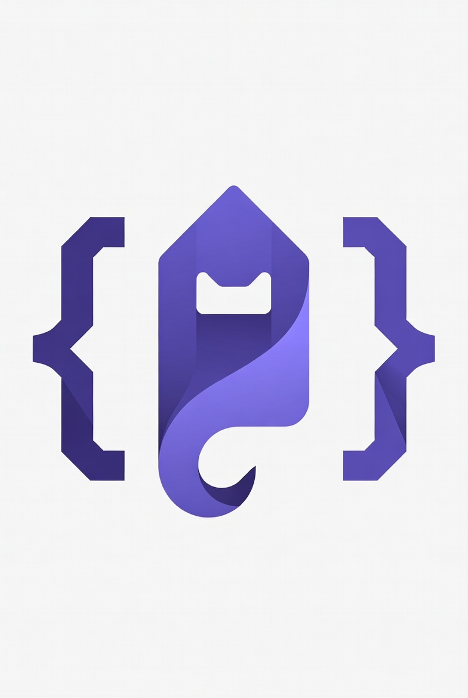

<p align="center">
  
</p>

<h1 align="center">Phantom Connect Kit</h1>

<p align="center">
  Ship Solana apps faster with pre-built components for Phantom Connect.
</p>

<p align="center">
  <a href="#quick-start">Quick Start</a> •
  <a href="#components">Components</a> •
  <a href="#api">API</a> •
  <a href="https://docs.phantom.com">Docs</a>
</p>

---

## Why

Building wallet connections is repetitive. This kit gives you production-ready components so you can focus on your app.

- **OAuth Login** — Google & Apple sign-in. No seed phrases.
- **Embedded Wallets** — Created instantly, ready to use.
- **Secure** — API keys server-side, address validation, tested.
- **Minimal** — No bloat. Just what you need.

## Quick Start

```bash
# Clone
git clone https://github.com/Pavelevich/phantom-connect-kit.git
cd phantom-connect-kit

# Install
npm install

# Configure
cp .env.example .env.local
# Add your NEXT_PUBLIC_PHANTOM_APP_ID from https://phantom.com/portal

# Run
npm run dev
```

Open [localhost:3000](http://localhost:3000)

## Components

### ConnectButton

```tsx
import { ConnectButton } from "@/components/phantom";

// Basic
<ConnectButton />

// With custom class
<ConnectButton className="my-class" />
```

### WalletInfo

Displays connected wallet address with copy and disconnect actions.

```tsx
import { WalletInfo } from "@/components/phantom";

<WalletInfo />
<WalletInfo showDisconnect={false} />
```

### BalanceCard

Shows SOL balance with USD value. Requires `HELIUS_API_KEY` in `.env.local`.

```tsx
import { BalanceCard } from "@/components/phantom";

<BalanceCard />
```

### NetworkBadge

```tsx
import { NetworkBadge } from "@/components/phantom";

<NetworkBadge network="mainnet" />
<NetworkBadge network="devnet" />
```

## API

### useBalance

```tsx
import { useBalance } from "@/hooks/use-balance";

const { balance, usdValue, isLoading, error, refetch } = useBalance(address);
```

### Balance API Route

```
GET /api/balance?address=<solana-address>

Response: { balance: number, usdValue: number | null }
```

## Structure

```
src/
├── app/
│   ├── api/balance/     # Secure balance endpoint
│   ├── layout.tsx       # PhantomProvider wrapper
│   └── page.tsx
├── components/
│   ├── phantom/         # Wallet components
│   └── ui/              # shadcn/ui
├── hooks/
│   └── use-balance.ts
└── __tests__/           # Vitest tests
```

## Configuration

| Variable | Required | Description |
|----------|----------|-------------|
| `NEXT_PUBLIC_PHANTOM_APP_ID` | Yes | From [phantom.com/portal](https://phantom.com/portal) |
| `HELIUS_API_KEY` | No | For balance fetching. [helius.dev](https://helius.dev) |

## Stack

- [Next.js 15](https://nextjs.org) — App Router
- [Phantom SDK](https://docs.phantom.com) — Wallet connection
- [Tailwind CSS](https://tailwindcss.com) — Styling
- [shadcn/ui](https://ui.shadcn.com) — Components
- [Vitest](https://vitest.dev) — Testing

## Scripts

```bash
npm run dev      # Development
npm run build    # Production build
npm run test     # Run tests
npm run lint     # Lint code
```

## License

MIT
